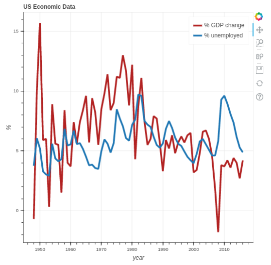

# US-Economic-Data-Dashboard
(as part of the Data Science Certification Program from IBM Cognitive Class)

<h2>Description</h2>
Extracting essential data from a dataset and displaying it is a necessary part of data science; therefore individuals can make correct decisions based on the data. In this assignment, the idea is to extract some essential economic indicators from some data and then display these economic indicators in a Dashboard. 

